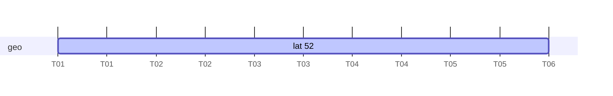
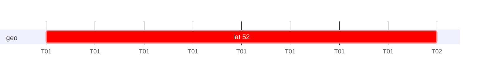
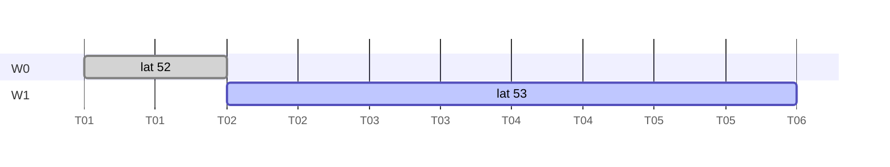
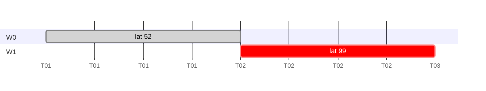
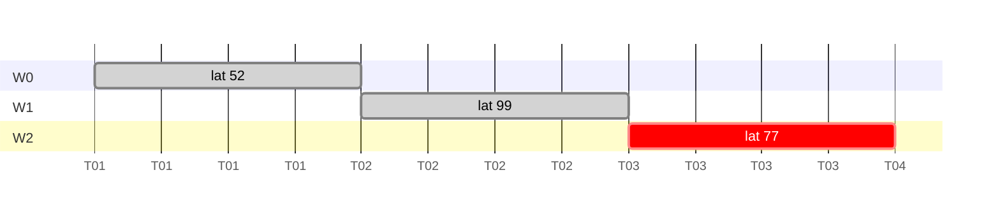
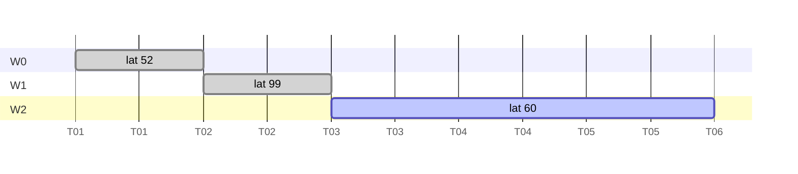
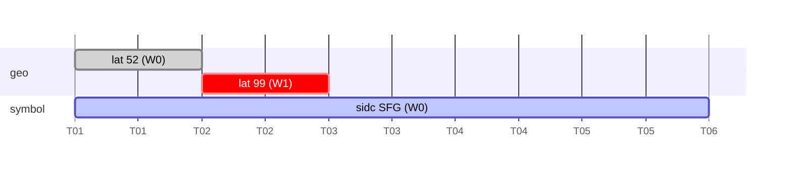
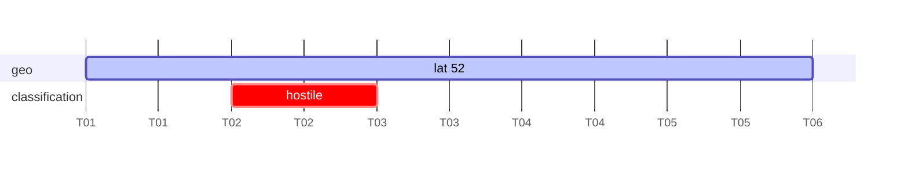
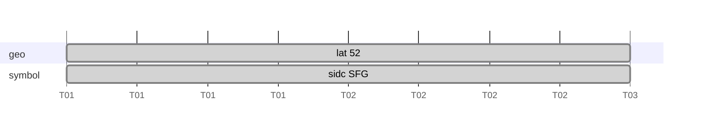
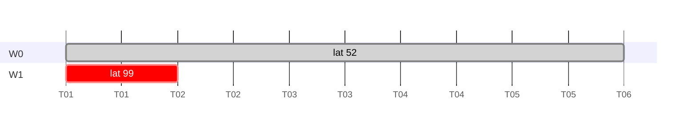

## Overview

Hydris is a complex system with many controllers being able to act independently. To support this, the world data model itself is a **CRDT (Conflict-free Replicated Data Type)**
built on component-level Last-Write-Wins registers.

Each component of an entity is an independent **LWW-Register**. Components from different controllers
can be merged without coordination because each controller owns distinct components.
The merge function is commutative and idempotent: applying the same set of updates in any order
produces the same final.

<Callout type="warn">
Two controllers should not push the same component on the same entity. The LWW merge will
resolve the conflict by timestamp, but the final depends on clock accuracy and message
ordering. If you need multiple writers for the same component, use separate entities
and fuse them at a higher level. If unavoidable, you can use Leases to coordinate two controllers, but the coordination is local only.
</Callout>

## Component-Level LWW-Register

When an entity is pushed that already exists, each non-nil component in the incoming entity
**replaces** the corresponding component in the existing entity. Components not present in
the incoming push are left unchanged.

```
existing:  { id: "s1", geo: {lat: 52}, symbol: {sidc: "SFG"}, label: "Alpha" }
incoming:  { id: "s1", geo: {lat: 53} }
final:    { id: "s1", geo: {lat: 53}, symbol: {sidc: "SFG"}, label: "Alpha" }
```

This is a **per-component LWW-Register**: each component slot is an independent register
that accepts the freshest write. Components are replaced **entirely**, not recursively merged.
If you push a `geo` component with only `latitude` set, the existing `longitude` and `altitude`
are lost.

## Lifetimes and Merge ordering

The engine tracks lifetimes **per component**. After merge, each component gets marked with the lifetime that was attached to the entity that the component originates from.

Each component is accepted or rejected independently. For each non-nil component in the
incoming push:

```
incoming_ts  = fresh ?? from   (of the incoming write)
existing_ts  = fresh ?? from   (of the existing component)

if incoming_ts > existing_ts  → replace component (and its lifetime)
if incoming_ts == existing_ts → tiebreak: shorter until wins
if incoming_ts < existing_ts  → reject (keep existing)
```

Components not present in the incoming push are never touched and their lifetimes remain intact.

### Expiry and GC

The garbage collector checks each component:

1. If a component's lifetime  has expired, clear it.
2. An entity is removed from the world only when all components are empty or expired.
3. `ExpireEntity` sets `until=now` on every component. This is a hard kill.

### Case reference

#### 1. Permanent push

| Write | data | fresh | until |
|-------|------|-------|-------|
| W0 | `geo: {lat: 52}` | T0 | — |



No `until` → geo lives indefinitely.

| component | value | fresh | until |
|-----------|-------|-------|-------|
| geo | `{lat: 52}` | T0 | — |

---

#### 2. Temporary push

| Write | data | fresh | until |
|-------|------|-------|-------|
| W0 | `geo: {lat: 52}` | T0 | T1 |



At T1, GC clears geo → no components remain → entity removed.

| component | value | fresh | until |
|-----------|-------|-------|-------|
| geo | `{lat: 52}` | T0 | T1 |

---

#### 3. Two writes, LWW

| Write | data | fresh | until |
|-------|------|-------|-------|
| W0 | `geo: {lat: 52}` | T0 | — |
| W1 | `geo: {lat: 53}` | T1 | — |



W1 is fresher → replaces W0.

| component | value | fresh | until |
|-----------|-------|-------|-------|
| geo | `{lat: 53}` | T1 | — |

---

#### 4. Temporary replaces permanent (LWW)

| Write | data | fresh | until |
|-------|------|-------|-------|
| W0 | `geo: {lat: 52}` | T0 | — |
| W1 | `geo: {lat: 99}` | T1 | T2 |



W1 is fresher → replaces W0. W0's permanent value is lost.
At T2, GC clears geo → entity removed.


| component | value | fresh | until |
|-----------|-------|-------|-------|
| geo | `{lat: 99}` | T1 | T2 |

---

#### 5. Multiple writes, freshest wins

| Write | data | fresh | until |
|-------|------|-------|-------|
| W0 | `geo: {lat: 52}` | T0 | — |
| W1 | `geo: {lat: 99}` | T1 | T3 |
| W2 | `geo: {lat: 77}` | T2 | T3 |



Each fresher write replaces the previous. Only W2 remains.
At T3, GC clears geo.

| component | value | fresh | until |
|-----------|-------|-------|-------|
| geo | `{lat: 77}` | T2 | T3 |

---

#### 6. Newer permanent supersedes temporary

| Write | data | fresh | until |
|-------|------|-------|-------|
| W0 | `geo: {lat: 52}` | T0 | — |
| W1 | `geo: {lat: 99}` | T1 | T3 |
| W2 | `geo: {lat: 60}` | T2 | — |



W2 is fresher → replaces W1. `until` is unset → geo lives indefinitely again.

| component | value | fresh | until |
|-----------|-------|-------|-------|
| geo | `{lat: 60}` | T2 | — |

---

#### 7. Push only affects pushed components

| Write | data | fresh | until |
|-------|------|-------|-------|
| W0 | `geo: {lat: 52}, symbol: {sidc: "SFG"}` | T0 | — |
| W1 | `geo: {lat: 99}` | T1 | T2 |



W1 only contains geo → symbol is untouched.
At T2, geo is cleared by GC. Symbol survives → entity survives.

| component | value | fresh | until |
|-----------|-------|-------|-------|
| geo | `{lat: 99}` | T1 | T2 |
| symbol | `{sidc: "SFG"}` | T0 | — |

---

#### 8. Component expires, entity survives

| Write | data | fresh | until |
|-------|------|-------|-------|
| W0 | `geo: {lat: 52}` | T0 | — |
| W1 | `classification: {identity: "hostile"}` | T1 | T2 |



At T2, classification expires. Geo is unaffected → entity survives.

| component | value | fresh | until | after T2 |
|-----------|-------|-------|-------|----------|
| geo | `{lat: 52}` | T0 | — | unchanged |
| classification | `{identity: "hostile"}` | T1 | T2 | cleared |

---

#### 9. ExpireEntity

| Write | action | fresh | until |
|-------|--------|-------|-------|
| W0 | push `geo: {lat: 52}, symbol: {sidc: "SFG"}` | T0 | — |
| — | `ExpireEntity("s1")` at T1 | — | — |



`ExpireEntity` sets `until=now` on every component — a hard kill.
Next GC clears all → entity removed.

| component | value | fresh | until |
|-----------|-------|-------|-------|
| geo | `{lat: 52}` | T0 | T1 (truncated) |
| symbol | `{sidc: "SFG"}` | T0 | T1 (truncated) |

---

#### 10. Same freshness, shorter until wins

| Write | data | fresh | until |
|-------|------|-------|-------|
| W0 | `geo: {lat: 52}` | T0 | — |
| W1 | `geo: {lat: 99}` | T0 | T1 |



Both writes have the same `fresh=T0`. Tiebreak: shorter `until` wins → W1 replaces W0.
At T1, GC clears geo → entity removed. The permanent value is not preserved.

| component | value | fresh | until |
|-----------|-------|-------|-------|
| geo | `{lat: 99}` | T0 | T1 |

---

#### 11. Entity-level lifetime reflects the largest component span

| Write | data | fresh | until |
|-------|------|-------|-------|
| W0 | `geo: {lat: 52}` | T0 | T3 |
| W1 | `track: {tracker: "t1"}` | T2 | T2 |

The entity-level `Lifetime` is derived from the component lifetimes:

- `from` = earliest component fresh (T0)
- `fresh` = latest component fresh (T2)
- `until` = latest component until (T3)

If any component has no `until` (permanent), the entity-level `until` is unset.

---

#### 12. Push without lifetime does not affect entity span or expiry

| Write | data | fresh | until | lifetime set? |
|-------|------|-------|-------|---------------|
| W0 | `geo: {lat: 52}, symbol: {sidc: "SFA"}` | T0 | T1 | yes |
| W1 | `administrative: {id: "REG-123"}` | — | — | no |

W1 has no `Lifetime` field at all. The component is accepted into the
entity, but excluded from the entity-level lifetime computation and from the
GC expiry decision:

- The entity-level `until` remains T1, not cleared to permanent.
- When all lifetime-bearing components expire, the entity is removed — components
  from no-lifetime pushes do not keep it alive.

Transformer-generated components (e.g. `ClassificationComponent` derived from a
`SymbolComponent`) are also excluded. They have no per-component lifetime entry,
so they neither affect the entity-level lifetime span nor prevent GC expiry.

To make an enrichment component participate in the lifetime span,
include a `Lifetime`. A `Lifetime` with `from` but no `until` marks the component
as permanent, which also makes the entity permanent (since the entity-level `until`
is only set when all lifetime-bearing components have one).

```
{ id: "s1", administrative: {id: "REG-123"}, lifetime: { from: <now> } }
```

If you want the component to survive independently but not prevent the entity from
expiring, omit `Lifetime` entirely.

